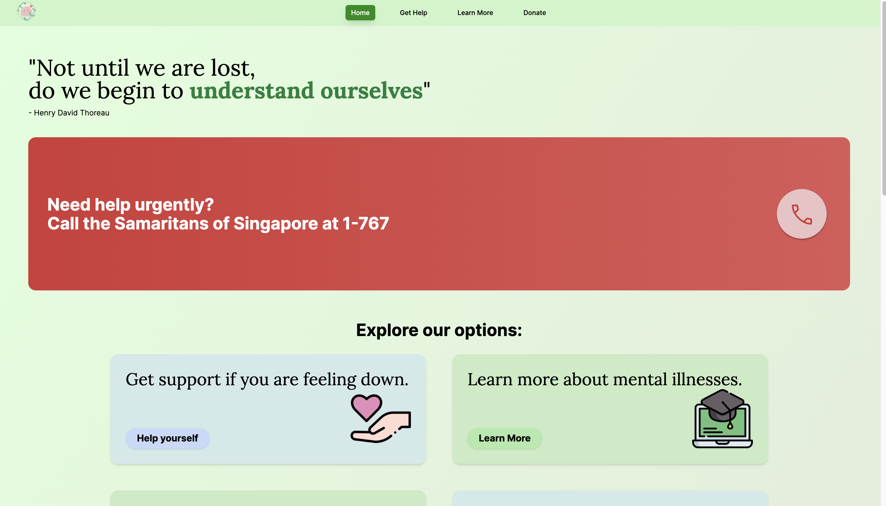
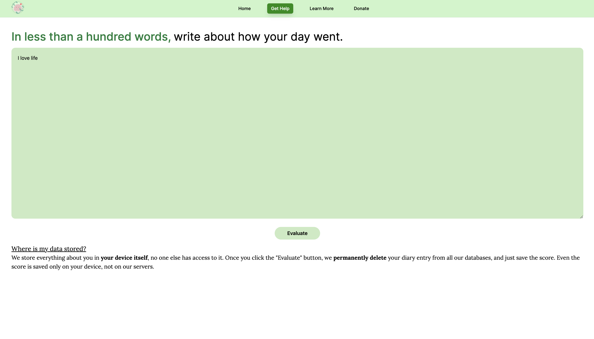
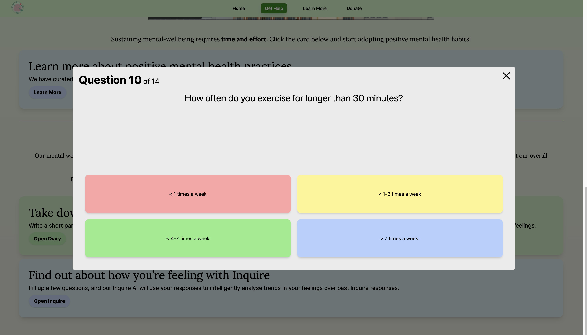
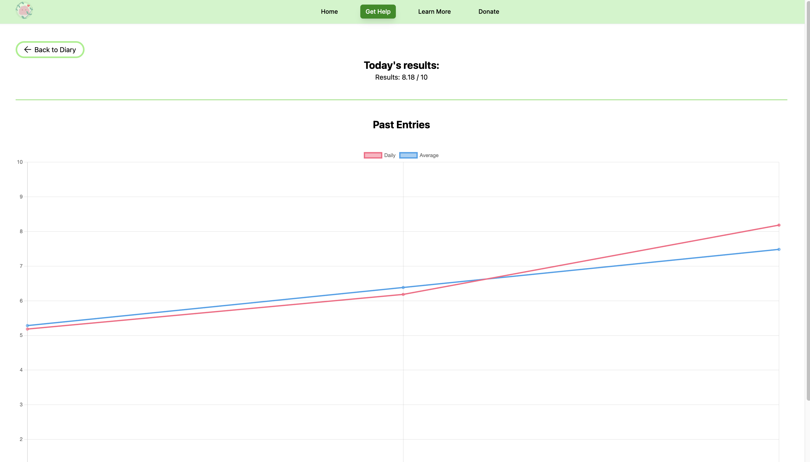
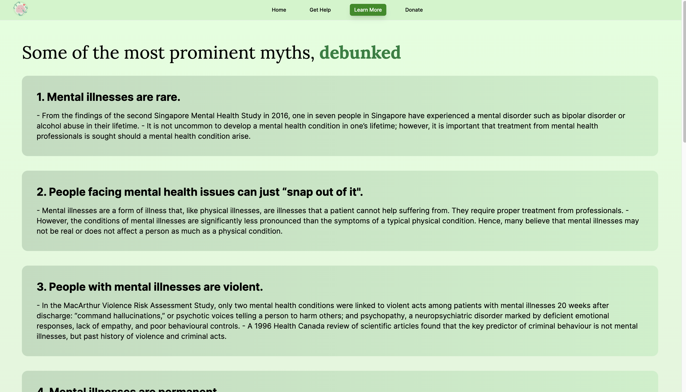
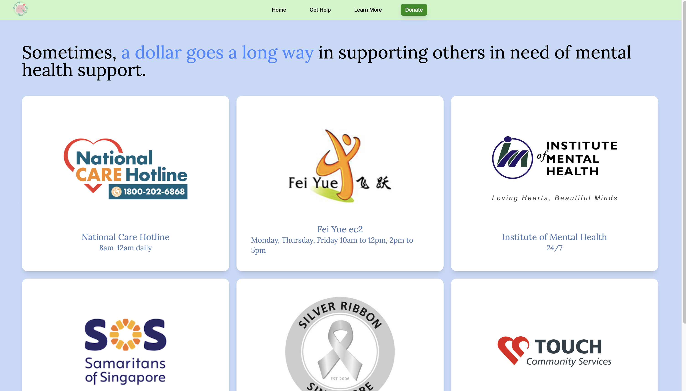

# [🌐 View MentalStop!](https://mentalstop-sstinc.web.app/)

# About

During the COVID-19 pandemic, social interactions were significantly reduced, resulting in mental wellness becoming one of the world's key focuses. MentalStop is a one-stop online resource that harnesses the capabilities of Artificial Intelligence to help youths with mental health conditions take charge of their mood, and provides a platform for the general public to gain awareness of mental health conditions.

As a testament to MentalStop's significant positive impact on the general community, it won the Distinction Award at the IMDA DigitalForLife Youth Awards in 2022.

# Features

### Home page

- Red call button for 24 hours help from the Samaritans of Singapore

- Quick links for the key resources and features in this app

- Segment to show the importance of seeking help

### Get Help page

- Information on 6 different organisations for users to get professional support

- Curated good mental health practices

- **Diary**
  
  - Functions just like a physical diary where users can write down their feelings and reflect on them. The user's writing is analysed using AI-powered sentiment analysis to detect the tone of the sentences and determine a mood score.

- **Inquire**
  
  - For users who are less motivated to write about their feelings in Diary. It is a questionnaire to allow one to reflect on their emotions, and is simpler and more convenient than Diary.

- **Intelligent Graph**
  
  - Gathers hundreds of data points from Diary and and analyses mood changes to display increasing or decreasing trends in the user’s emotion, allowing users to better gauge their progress in improving their mental health.

### Learn More page

- Contains debunked myths and information on common mental illnesses, helping to fight stereotypes and misconceptions that lead to improper care and treatment.

### Donate page

- Links users to donation pages of reputable organisations that provide free support to those who need it

# Screenshots

    
    
    
    
    
    

# Credits

MentalStop was created by Tan Xuan Han (leader), Sean Ulric Buguina Chua, Harish Ram Baghavath, Tay Kai Quan and Asher Ng Say Kiat.

MentalStop is one of many projects created under Project Serve at SST Inc in the School of Science and Technology, Singapore. SST Inc is a startup incubator and ICT Talent Development Programme that nurtures members to create applications to serve the community. Learn more about SST Inc: https://www.sstinc.org/
